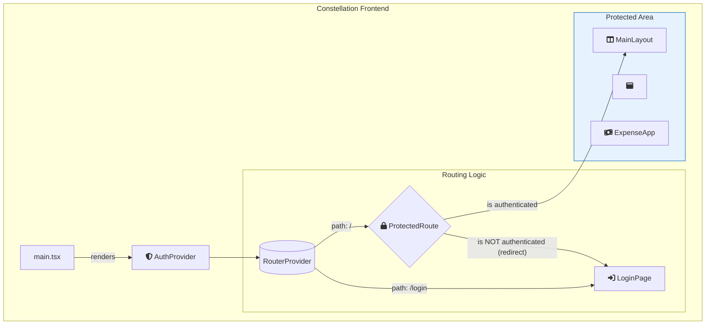

# Constellation Frontend

[](https://react.dev/)
[](https://vitejs.dev/)
[](https://tailwindcss.com/)
[](https://www.typescriptlang.org/)

The frontend application for the **Constellation** ecosystem. This project serves as a unified portal to access various modules, implementing a modern "Application Shell" model to provide a seamless, single-page application experience.

It emphasizes a clean, responsive, and highly customizable user interface, built with a modern frontend toolchain including Vite and React.

## Project Architecture

This is a React monorepo managed with `npm`. It is structured to be scalable and maintainable.

- **`/src/components`**: Holds shared, reusable, "dumb" components (e.g., buttons, inputs).
- **`/src/hooks`**: Contains custom React hooks (e.g., `useClickOutside`) to share logic across components.
- **`/src/pages` or `/src/apps`**: Can hold self-contained application modules (our "Stars").
- **`/src/contexts` (Implicit)**: Global state management (Theme, Animations) is handled via React Context API, defined within `App.tsx`.
- **`/src/services`**: Holds modules responsible for external communication, such as the API client.

```text
constellation-frontend/
│
├── .env.local                # Local environment variables
├── index.html
├── package.json
├── README.md                 # This file
│
└── src/
    ├── App.tsx               # Root component with providers & router setup
    ├── main.tsx              # Application entry point
    │
    ├── components/
    │   └── ProtectedRoute.tsx  # Route guard for authenticated users
    ├── contexts/
    │   └── AuthContext.tsx     # Global state management for authentication
    ├── hooks/
    │   └── useClickOutside.ts
    ├── pages/
    │   ├── LoginPage.tsx
    │   ├── SignupPage.tsx
    │   └── ErrorPage.tsx
    └── services/
        └── api.ts              # Centralized Axios client for API communication
```



## Tech Stack

- **Framework**: [React 19](https://react.dev/)
- **Language**: [TypeScript](https://www.typescriptlang.org/)
- **Build Tool**: [Vite](https://vite.dev/)
- **Styling**: [Tailwind CSS v3](https://tailwindcss.com/)
- **Routing**: [Routing](https://reactrouter.com/)
- **Data Fetching**: [axios](https://axios-http.com/)
- **JWT Handling**: [jwt-decode](https://github.com/auth0/jwt-decode)
- **Global State**: React Context API

## Local Development Setup

### Prerequisites

- Node.js (`v18.x` or `v20.x` LTS recommended)
- `npm` (comes bundled with Node.js)

### Installation & Setup

1. **Clone the repository:**

   ```bash
   git clone [your-frontend-repository-url]
   cd constellation-frontend
   ```

2. **Install dependencies:**

   This command installs all necessary packages from `package.json`.

   ```bash
   npm install
   ```

### Configuration
  
Create your local `.env.local` file from the template. This file is for local development variables and is ignored by Git.

```bash
cp .env.example .env.local
```

Then, edit the `.env.local` file with the base URL for the backend API services.

|Variable|Description|Example|
|---|---|---|
|`VITE_API_BASE_URL`|The base URL for the backend API gateway or individual services.| `<http://localhost:8001>`|

### Running the Application

This command starts the Vite development server with hot-reloading enabled.

```bash
npm run dev
```

## Available Scripts

- `npm run dev`: Starts the development server.
- `npm run build`: Compiles and bundles the application for production.
- `npm run lint`: Lints the codebase using ESLint.
- `npm run preview`: Serves the production build locally for testing.

## 🔐 Authentication Flow

Authentication is managed globally via `AuthContext`, which handles token storage, user state, and API calls.

- **Protected Routes**: The main application (`MainLayout`) is wrapped in a `ProtectedRoute` component. Unauthenticated users attempting to access any page under `/` will be automatically redirected to `/login`.
- **User Journey**:
    1. New users register on the `/signup` page. The backend creates their account with `verified: false`.
    2. Upon success, they are redirected to a `/pending-verification` page, informing them that their account requires administrator approval.
    3. An administrator manually updates the user's `verified` status to `true` in the database.
    4. Verified users can now log in via the `/login` page.
    5. A successful login stores a JWT `access_token` and `refresh_token` in `localStorage` and grants access to the main application.
    6. The central `axios` client automatically attaches the `access_token` as a Bearer token to all subsequent API requests.

## 🎨 Key Features & UI Controls

The UI provides several customization options, located in the top-right corner of the content area header.

- **Theme Toggle (Sun/Moon Icon)**: Switches between Light and Dark mode.
- **Animation Toggle (Sparkles/Clock Icon)**: Enables or disables the background star animations.
- **Background Toggle (Image/Slash Icon)**: Toggles the entire starry sky background effect on or off.

All preferences are saved to the browser's `localStorage` and will persist between sessions.
